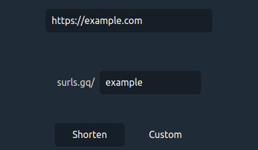

# Welcome to Surl!

Surl is a simple, no-nonsense url shortener

You can try it live at [surls](https://surls.gq/)

Here's what it looks like:

Click on `Shorten` and voila!

You can also create a **custom** url ending

